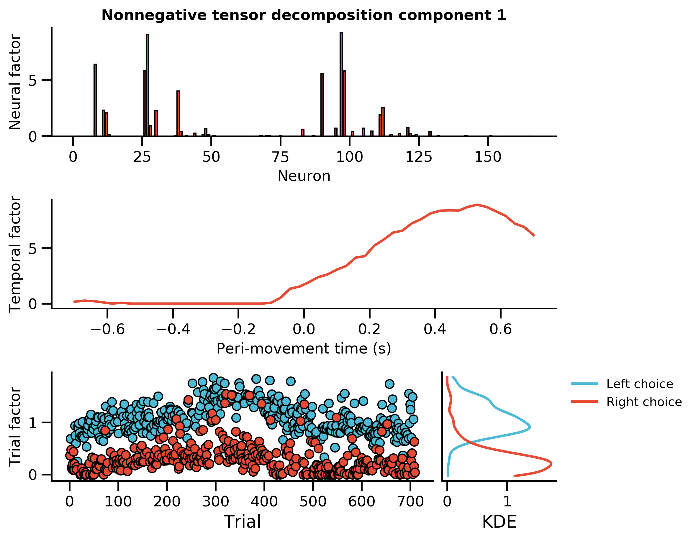

# Williams et al 2018: Unsupervised discovery of demixed, low-dimensional neural dynamics across multiple timescale through tensor component analysis.

### Tim Sit

### 2020 May 1

<!--v-->

## The paper

<iframe src="./pdfs/williams2018unsupervised.pdf"
width="100%" height=800>
</iframe>

<!--h-->

## Outline 

 1. History and background: Matrix and tensor factorisation methods
 2. Tensor component analysis for neural data
 3. Examples 
 4. Extensions and further reading

<!--h-->

## 1 | Matrix and tensor factorisation

<!--h-->

### We usually represent neural data as matrices 

Example 

$$
\mathbf{X} \in \mathbb{R}^{N \times T}
$$

where: 

 - $N$ is the number of neurons
 - $T$ is the number of time bins

<!--h-->

### In matrix factorisation, we want to reconstruct the data from smaller matrices

 

$$
\mathbf{X} \approx \hat{\mathbf{X}} =  \mathbf{UV}^\intercal
$$

Another way to think about this is that we want to minimise the difference between the data and our approximation of it

$$
\min_{\mathbf{U}, \mathbf{V}} = \vert\vert \mathbf{X} - \mathbf{UV}^\intercal \vert\vert^2_{F}
$$

Applied to neural data, we can think of our data matrix $\mathbf{X} \in \mathbb{R}^{N \times T}$, such that: <!-- .element: class="fragment current-visible" data-fragment-index="2" -->

 - $\mathbf{U} \in \mathbb{R}^{N \times R}$ will be our neuron factors, where $R$ is the number of factors (components) we want to reconstruct our data with <!-- .element: class="fragment current-visible" data-fragment-index="2" -->
 - $\mathbf{V} \in \mathbb{R}^{T \times R}$ will be our temporal factors <!-- .element: class="fragment current-visible" data-fragment-index="2" -->
 
 
 

Many dimensionality methods can be framed as solving the above problem (usually with additional regularisation or constraints) <!-- .element: class="fragment current-visible" data-fragment-index="3" -->

A comment I found from Alex William's notes <!-- .element: class="fragment current-visible" data-fragment-index="3" -->

 <!-- .element: class="fragment current-visible" data-fragment-index="3" -->

<!--v-->

### How this reconstruction happens

One way to think about multiplying two matrices is that it is just the sum of the outer product of the columns of the first matrix and the rows of the second matrix:

$$
\begin{equation}
\begin{bmatrix}
\mathbf{u}_1 & \mathbf{u}_2 & ... & \mathbf{u}_n
\end{bmatrix}
\begin{bmatrix}
\mathbf{v}_1 \\\ \mathbf{v}_2 \\\ ... \\\  \mathbf{v}_n
\end{bmatrix} = \sum_i^N \mathbf{u}_i \otimes \mathbf{v}_i 
\end{equation}
$$

 <!-- .element  width="45%"--> 

<!--v-->

### Example

<!-- .element  width="100%"--> 

<!--v-->

### Principal Component Analysis (PCA) as minimising reconstruction error 

The objective function of PCA can be written as 

$$
\min_{\mathbf{V}} \vert\vert \mathbf{X} - \mathbf{X}\mathbf{V}\mathbf{V}^\intercal \vert\vert^2_\mathrm{F}
$$

subject to $\mathbf{V}$ being an orthogonal matrix, meaning that $\mathbf{C}$ is a square matrix with orthogonal columns and rows with unit length. More formally defined by the property that: $\mathbf{C}\mathbf{C}^\intercal = \mathbf{V}^\intercal \mathbf{V} = \mathbf{I}$

We can write our equation back to the familiar form of thinking about our reconstruction as just multiplyling two matrices if we set $\mathbf{U} = \mathbf{XV}$

<!--v-->

### Non-negative matrix factorisation (NMF) as minimising reconstruction error

[Lee and Song 1999: Learning the parts of objecs by non-negative matrix factorizataion](https://www.nature.com/articles/44565)

With the simple additional constraint that our matrices have to be zero or positive $\mathbf{U} \geq 0, \mathbf{V} \geq 0$. This has the advantage of giving factors that are (1) sparse and (2) positivitely combined

This will become relevant to the tensor component analysis method introduced in this paper because there is also a non-negative variant of Tensor Component Analysis.

<!--h-->

### Tensor and tensor decomposition 

We can extend the idea of representing data as a "2D" (second order) matrix to a "3D" (third order) tensor:

$$
\boldsymbol{\mathcal{X}}  \in \mathbb{R}^{N \times T \times K}
$$

where:

 - $N$ is the number of neurons
 - $T$ is the number of time points 
 - $K$ is the number of trials 

 

<!--v-->

#### History of tensor methods

 <!-- .element  width="120%"--> 

 - Idea first introduced by Hitchcock 1927
 - Originally applied to chemometrics and psychometrics
 - Recently gain popularity through application in analysing videos and image of human faces
 
 
 
 
 

<!--v-->

#### Two main tensor decomposition methods 

CP (canonical polyadic) tensor decomposition 

 <!-- .element  width="100%"--> 

This is the method used by tensor component analysis.
Main effect: One neuron factor per temporal factor per trial factor. 

$\boldsymbol{\mathcal{X}} \approx \sum_{r=1}^{R} \mathbf{a}_r \circ \mathbf{b}_r \circ \mathbf{c}_r$

 
 

 
Tucker tensor decomposition

 <!-- .element  width="100%"--> 

Main effect: One neuron factor can be associated with multiple temporal / trial factors. But this makes interpretation difficult.

$\boldsymbol{\mathcal{X}} \approx \boldsymbol{\mathcal{G}} \times_1 \mathbf{A} \times_2 \mathbf{B} \times_3 \mathbf{C}$

 
 

 
 

<!--v-->

### TCA vs. PCA: uniqueness of solution

PCA can reconstruct your data well (unique solution) if you assume: 

 1. Your factors are orthogonal 
 2. Your factors have large eigengaps (the magnitude of your factors are very different)

TCA can reconstruct you data well allowing for: 

 1. Your factors only have to be linearly independent 
 2. You have small eigengap 

[Kruskal 1977: Linear independence is sufficient for tensor decomposition identifiability (for rank-3 tensors)](https://www.sciencedirect.com/science/article/pii/0024379577900696)
 
 Also see [Rhodes 2010: A concise proof of Kruskal's theorem on tensor decomposition](https://www.sciencedirect.com/science/article/pii/S0024379509006132)

<!--h-->

## 2 | Tensor Component Analysis 

<!--h-->

### The main selling point of TCA is you get a *trial factor*

 <!-- .element  width="90%"--> 

<!--h-->

### TCA is equivalent to a feedforward neural network with gain modulation

Feedfoward network 

- You have some latent factors as input (eg. movement, decision, stimulus etc.
- The activity of your neurons is some weighted combination of these latent factors 

 
Gain modulation <!-- .element: class="fragment" data-fragment-index="2" -->
 
- You assume that the shape of the time couse of each neuron remain the same across trials <!-- .element: class="fragment" data-fragment-index="2" -->
- But the amplitude of this time course is scaled depending on the trial <!-- .element: class="fragment" data-fragment-index="2" -->

 

 <!-- .element  width="30%"--> 

  <!-- .element  width="70%"--> <!-- .element: class="fragment current-visible" data-fragment-index="1" -->

  <!-- .element  width="70%"--> <!-- .element: class="fragment current-visible" data-fragment-index="2" -->

<!--v-->

### Demo of best-case scenario for TCA

 <!-- .element  width="100%"-->

<!--v-->

### Does that mean TCA is not suitable for modelling recurrent networks?

Not necessarily.

 <!-- .element  width="100%"-->

<!--h-->

### TCA + Time Warping 

If you remember from a few months ago in Kevin's journal club:

[Williams et al 2019: Discovering Precise Temporal Patterns in Large-Scale Neural Recordings through Robust and Interpretable Time Warping]()

  <!-- .element  width="80%"--> 

Now you can do both time warping and TCA 
&#128512;

[Williams 2020: Combining tensor decomposition and time warping models for multi-neuronal spike train analysis](https://scholar.google.com/scholar?hl=en&as_sdt=0%2C5&q=williams+2020+combining+tensor&btnG=)

<!--v-->

<iframe src="./pdfs/williams2020combining.pdf"
width="100%" height=800>
</iframe>

<!--v--> 

<iframe border=0 frameborder=0 height=500 width=550
src="https://twitframe.com/show?url=https%3A%2F%2Ftwitter.com%2FSuryaGanguli%2Fstatus%2F1202637594606981120"
</iframe>

<!--h-->

## 3 | Examples 

<!--h-->

### Spatial navigation task 

Recording using a miniature micro-endoscope in the medial prefrontal cortex whilst:

1. Mouse is placed either on the east or west of the maze 
2. Mouse then decide either to go north or go south 
3. Mouse gets water as reward or gets nothing (rule changes on different sessions)
4. Dataset: 282 neurons, 111 time points, 600 trials, $\boldsymbol{\mathcal{X}} \in \mathbb{R}^{282 \times 111 \times 600}$

<!--h-->

#### TCA can reconstruct your data well with few parameters 

PSTH of individual neurons can be reconstructed well with 15 components

 <!-- .element  width="100%"-->

 <!-- .element  width="100%"-->

 <!-- .element  width="100%"-->

<!--v-->

#### TCA can reconstruct your data well with few parameters 

 <!-- .element  width="100%"-->

Parameters

  - Trial-average PCA: You take the average across trials, so only neural factor and temporal factor 
  - TCA / NTCA: Neural factor, temporal factor, trial factors
  - Concatenated PCA: Neural factor, and individual sets of temporal factor for each trial

<!--v-->

#### "How do I know TCA is not overfitting?" 

Method 1: cross-validate the reconstruction error

 <!-- .element  width="70%"--> <!-- .element: class="fragment current-visible" data-fragment-index="1" -->

 <!-- .element  width="70%"--> <!-- .element: class="fragment current-visible" data-fragment-index="2" -->

Even with 10% of the data, they have 90 data points per free parameter. <!-- .element: class="fragment current-visible" data-fragment-index="2" -->

<!--v--> 

#### "How do I know TCA is not overfitting?" 

Method 2: check that the factors you obtain are similar across optimisations.

 <!-- .element  width="45%"-->

<!--v--> 

#### "How do I know TCA is not overfitting?" 

Method 3: Look at how well you are fitting each neuron depending on how reliable they fire 

 <!-- .element  width="100%"-->

 - 'dimensionality': low dimensionality means firing reliably across trials 
 - variance: dynamic range of neural activity

<!--h-->

#### Factors extracted by (nonnegative) TCA are interpretable

Reminder: TCA is unsupervised, and the trial metadata are added post-hoc. (TCA performed here with 15 components, 7 not shown but are similar)

 <!-- .element  width="100%"-->

 
 
 $T=0$ Mouse at initial positoin. $0 \leq T \leq 5$ Mouse stay at initial position $5 \leq T \leq 7$ Mouse move to new location. $7 \leq T \leq 12$ Mouse at final position

 

 Component 1 and 2: neurons selective to initial position <!-- .element: class="fragment fade-in-then-semi-out" data-fragment-index="1" -->
 
 Component 5 and 6: neurons selective to the final position <!-- .element: class="fragment fade-in-then-semi-out" data-fragment-index="2" -->
 
 Component 7 and 8: neurons selective to reward (blue line: position rewarded changed) <!-- .element: class="fragment fade-in-then-semi-out" data-fragment-index="3" --> 
 
Thought: "These components are not difficult to pick up using other analysis technique." <!-- .element: class="fragment fade-in-then-semi-out" data-fragment-index="4" -->

Component 3: some neurons fire just before final-location-selective neurons fire  <!-- .element: class="fragment fade-in-then-semi-out" data-fragment-index="5" -->

Component 4: All neurons decrease activity within each day (arousal related?) <!-- .element: class="fragment fade-in-then-semi-out" data-fragment-index="6" -->
 

 
 
 

<!--v-->

#### "I have to see the other 7 components"

 <!-- .element  width="80%"-->

<!--v--> 

#### "What if I just do PCA on the data instead?"

For comparison purposes, Alex and others perform trials unfolding PCA, ie. you do PCA on $\mathbf{X} \in \mathbb{R}^{K \times NT}$

 <!-- .element  width="80%"--> <!-- .element: class="fragment current-visible" data-fragment-index="1" -->

 

 <!-- .element  width="80%"--> <!-- .element: class="fragment current-visible" data-fragment-index="2" -->

 

 - each row represent one component <!-- .element  width="50%"--> <!-- .element: class="fragment current-visible" data-fragment-index="2" -->
 - components sorted from most to least variance explained <!-- .element  width="50%"--> <!-- .element: class="fragment current-visible" data-fragment-index="2" -->

Thought: Since we are using nonnegative TCA, will be more fair to compare with nonnegative matrix factorisation. <!-- .element: class="fragment current-visible" data-fragment-index="2" -->

<!--h-->

### Audiovisual decision making task 

  <!-- .element width="40%"-->

Data: neuropixel recording of MOs neurons, aligned to movement, trials involve either left/right choices.

<!--h-->

### The code is easy to use (but documentation can be better)

[Tensotools: fitting tensor decompositions in Python](https://github.com/ahwillia/tensortools)

<pre><code class="python">
import tensortools as tt

# Neuron * Time Points * Trials 
X = my_dataset['firing_rate'].values 

num_components = 8

# CP tensor decomposition solved with ALS
result = tt.cp_als(X, rank=num_components) 

# Prebuilt function to plot all factors
fig, _, _ = tt.plot_factors(result.factors)

</code></pre>

<!--h-->

### Audiovisuals task: TCA component 1

 <!-- .element  width="80%"-->

<!--v-->

 <!-- .element  width="80%"-->

<!--v-->

 <!-- .element  width="80%"-->

<!--v-->

 <!-- .element  width="80%"-->

<!--v-->

 <!-- .element  width="80%"-->

<!--h-->

## Summary 

 1. TCA exploit the fact neural data can be organised by trials to give more interpretable components that relate to (a) within trial neural activity and (b) changes in amplitude of these activity across trials <!-- .element: class="fragment fade-in-then-semi-out" data-fragment-index="1" -->
 
 2. Most task-related components that are retrieved probably can also be found using other methods, but since TCA is unsupservised, you may find components that were not obvious to you initially <!-- .element: class="fragment fade-in-then-semi-out" data-fragment-index="2" -->
 
 
 - Pros: interpretable factors, trial factors, IMO simpler than other extensions/alternatives of PCA (eg. demixed PCA, Gaussian Process Factor Analysis). <!-- .element: class="fragment fade-in-then-semi-out" data-fragment-index="3" -->
 
 - Cons: not an established technique, components may be different depending on the selected number of components (though it is possible to re-align them), and no closed form solution so you need to run iterations to get solution (ie. it may be slower) <!-- .element: class="fragment fade-in-then-semi-out" data-fragment-index="4" -->
 
 
 
 

 <!--h-->
 

## Further reading

 - If you couldn't understand me, then the [author also did a talk about it](https://www.youtube.com/watch?v=hmmnRF66hOA&t=2s)
 - A good introduction to tensor decomposition: [Kolda and Bader 2009](https://epubs.siam.org/doi/abs/10.1137/07070111x)
 - Someone asked on Quora: [What is all the current fuss about data tensor decomposition? ](https://www.quora.com/What-is-all-the-current-fuss-about-data-tensor-decomposition-and-analysis-Data-analysis-and-historical-perspective)

 <!--h-->
 
 

